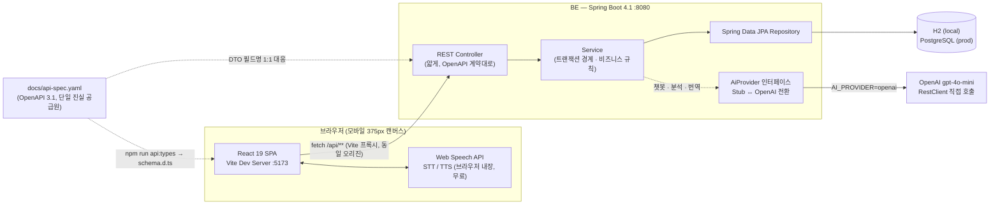

# MBN AI 트롯 팬덤 플랫폼

MBN AI 해커톤 출품작 — 트롯 스타의 공식 콘텐츠·일정, 팬 커뮤니티, AI 팬 매니저를 하나로 묶은
**글로벌 트롯 팬덤 플랫폼**.

## 빠른 시작

사전 요구사항: Node 22+, JDK 17

```bash
# 1) 백엔드 — http://localhost:8080
cd BE && ./gradlew bootRun

# 2) 프론트엔드 — http://localhost:5173  (다른 터미널에서)
cd FE && npm install && npm run api:types && npm run dev
```

`npm run api:types`는 `docs/api-spec.yaml`에서 TypeScript 타입을 생성합니다.
`FE/src/api/schema.d.ts`는 생성물이라 git에 포함되지 않으므로 **최초 1회 반드시 실행**해야 합니다.

동작 확인:

```bash
curl http://localhost:8080/api/v1/stars/1
# {"id":1,"name":"임영웅", ... ,"greeting":"오늘 하루도 즐거운 하루되세요!", ...}
```

H2 콘솔: http://localhost:8080/h2-console (JDBC URL `jdbc:h2:mem:trot`, user `sa`, 비밀번호 없음)

## 구조

| 경로 | 내용 |
|---|---|
| `FE/` | React 19 + TypeScript 6 + Vite 8 (모바일 퍼스트) |
| `BE/` | Spring Boot 4.1 + Java 17 + JPA (H2 로컬 / PostgreSQL 운영) |
| `docs/` | 기획·계약 문서 — **단일 진실 공급원** |
| `기획문서/` | 원본 기획안 (참조 전용) |
| `(초안) 와이어프레임 및 UI 기초/` | 원본 와이어프레임 3종 |

## 시스템 아키텍처

### 개요



- **계약 우선**: `docs/api-spec.yaml`을 먼저 고치고 FE(`schema.d.ts` 자동 생성)·BE(DTO) 양쪽에 반영합니다.
- **AI는 인터페이스 뒤로 숨김**: `AiProvider` 구현체를 `StubAiProvider`(기본, LLM 없이 DB 근거로 응답) ↔
  `OpenAiProvider`로 설정 한 줄(`AI_PROVIDER`)로 전환합니다. 상세 파이프라인은 [`docs/ai-stack.md`](docs/ai-stack.md).
- **음성은 전부 브라우저 내장**: STT/TTS 모두 `Web Speech API` / `speechSynthesis`로 처리되어 BE를 거치지 않습니다 (무료·저지연).
- **정적 모바일 전용**: 데스크톱 레이아웃 분기 없이 375px 캔버스 하나로 고정.

### 기술 스택

**Frontend (`FE/`)**

| 영역 | 기술 |
|---|---|
| 프레임워크 | React 19 |
| 언어 | TypeScript 6 (`erasableSyntaxOnly` — 생성자 파라미터 프로퍼티·enum 미사용) |
| 빌드 도구 | Vite 8 (dev 서버가 `/api`를 BE `:8080`으로 프록시) |
| 서버 상태 | TanStack Query 5 (수동 `useEffect` 페칭 금지) |
| 라우팅 | React Router 7 |
| 다국어 | i18next + react-i18next — 7개 언어(ko/en/fr/ja/es/zh/ru) |
| 스타일 | CSS Modules + CSS 변수 (Tailwind·CSS-in-JS 미사용) |
| API 타입 | `openapi-typescript` — `docs/api-spec.yaml` → `schema.d.ts` 자동 생성 |
| 개발용 목업 | MSW (BE 미구현 구간) |
| 린트/포맷 | oxlint, Prettier |

**Backend (`BE/`)**

| 영역 | 기술 |
|---|---|
| 프레임워크 | Spring Boot 4.1 |
| 언어 | Java 17 |
| 빌드 도구 | Gradle (wrapper) |
| 영속성 | Spring Data JPA + Hibernate |
| DB | H2 인메모리(`local`, 시드 `data.sql`) / PostgreSQL(`prod`, `ddl-auto: validate`) |
| 인증 | Spring Security + 간이 HMAC 서명 토큰 (JWT 라이브러리 미사용, 소셜 로그인 없음) |
| API 계약 | OpenAPI 3.1 (`docs/api-spec.yaml`) |
| AI 연동 | OpenAI `gpt-4o-mini`, SDK 없이 `RestClient` 직접 호출 |
| 실시간 응답 | SSE (챗봇 스트리밍) |
| 보일러플레이트 | Lombok (엔티티에는 `@Data`/`@Setter` 미사용) |

**인프라 / 도구**

| 영역 | 내용 |
|---|---|
| CI | GitHub Actions — `be.yml` / `fe.yml`, 경로 필터링으로 변경된 쪽만 실행 |
| 디자인 | Figma |

### 폴더 구조

**`FE/src/`** — 기능별이 아닌 **레이어별** 구성 (컴포넌트 성격에 따라 세분화)

```
FE/src/
├── api/           client.ts (fetch 래퍼 + 엔드포인트), schema.d.ts (자동 생성, gitignore)
├── app/           App.tsx (라우팅 + 선택된 스타 컨텍스트), constants.ts
├── assets/        icons/, mascot/(비엔이 이미지), example/
├── components/
│   ├── ai/          AiPanel — AI 분석 패널
│   ├── article/      ArticleBody
│   ├── artist/       ArtistCard
│   ├── comment/      Reply
│   ├── content/      ContentCard, CommentPreview
│   ├── gathering/     GatheringCard
│   ├── layout/       AppShell(3탭 공유 셸), HeaderBack, LanguageSheet
│   ├── play/         PlaceCard, PlayCard, TipCard
│   └── ui/           BottomSheet, Chip, Icon, ProgressBar, Section, Skeleton,
│                      StatusBadge, Toast 등 재사용 프리미티브
├── data/          programs.ts (정적 데이터)
├── features/
│   ├── artist/       selectedArtist (선택된 스타 상태)
│   ├── auth/         LoginSheet, useAuth (간이 데모 인증)
│   └── voice/        VoiceAssistant, useSpeech, useSpeechRecognition, mascot
│                      — 비엔이 음성 AI 4단계 플로우
├── i18n/          index.ts + locales/{ko,en,fr,ja,es,zh,ru}.json
├── lib/           contentRoute, format 등 유틸
├── pages/         HomePage / CommunityPage / PlayPage / ChatPage 등 화면 14종
└── styles/        tokens.css (Figma 실측 디자인 토큰), global.css
```

**`BE/src/main/java/kr/co/mbn/trot/`** — **도메인별 수직 분할**, 각 도메인이 5개 레이어
(`domain` · `repository` · `service` · `dto` · `controller`)를 가짐. `star` 패키지가 표준 예시.

```
kr/co/mbn/trot/
├── config/          SecurityConfig 등 전역 설정
├── common/
│   ├── error/        ErrorCode, ApiException, ErrorResponse, GlobalExceptionHandler
│   ├── dto/          PageResponse (Page 직렬화 규약 통일)
│   └── security/     CurrentUserProvider
├── star/            스타 프로필
├── home/            홈 화면 집계 API (일정 + 콘텐츠 + 모임 한 번에)
├── schedule/        일정
├── content/         기사·영상 (구 Archive) + Channel
├── comment/         댓글 + CommentTranslation (번역 캐시)
├── reaction/        좋아요
├── subscription/    구독
├── gathering/       오프라인 모임 + 신청 (정원 경합 — 비관적 락으로 동시성 제어)
├── place/           장소 (공개 출처만, sourceUrl 필수)
├── tip/             여행 팁
├── search/          통합 검색
├── chat/            AI 챗봇 세션 · 메시지 · 근거(citation), EvidenceFinder(스코프 분류)
├── ai/
│   ├── provider/      AiProvider 인터페이스, StubAiProvider, openai/OpenAiProvider·OpenAiClient·AiUsageGuard
│   ├── service/       AiAnalysisService, AiAnalysisWarmup (기동 시 사전 생성)
│   └── domain, dto, repository, controller
├── auth/            간이 인증 (HMAC 서명 토큰, DemoAuthFilter)
└── user/            사용자, 국가(Country), 로케일(Locale)
```

```
BE/src/main/resources/
├── application.yml   local(H2) / prod(PostgreSQL) 프로파일
└── data.sql          시드 데이터 (데모 품질에 직결)
```

## 문서

| 파일 | 내용 |
|---|---|
| [**`docs/HANDOFF.md`**](docs/HANDOFF.md) | **작업 재개 지점 — 새 환경에서 시작한다면 여기부터** |
| [`docs/design-spec.md`](docs/design-spec.md) | 화면 13개의 기능 명세 (Figma 확정본) |
| [`docs/component-map.md`](docs/component-map.md) | 컴포넌트 ↔ Figma 노드 ID 매핑 |
| [`docs/ai-stack.md`](docs/ai-stack.md) | AI 4종의 모델 선정과 파이프라인 |
| [`docs/api-spec.yaml`](docs/api-spec.yaml) | OpenAPI 3.1 API 계약. FE/BE 모두 이것을 따릅니다 |
| [`docs/design-tokens.md`](docs/design-tokens.md) | Figma 실측 디자인 토큰 |
| [`docs/domain-model.md`](docs/domain-model.md) | 엔티티 정의와 공통 규약 |
| [`docs/mvp-scope.md`](docs/mvp-scope.md) | 우선순위와 데모 골든 패스 |
| [`docs/worklog-be.md`](docs/worklog-be.md) | 백엔드 구현 현황과 다음 작업 |
| [`docs/worklog-fe.md`](docs/worklog-fe.md) | 프론트엔드 구현 현황과 다음 작업 |
| [`CLAUDE.md`](CLAUDE.md) | Claude Code 작업 규칙 |

## 환경변수

| 변수 | 위치 | 용도 |
|---|---|---|
| `OPENAI_API_KEY` | BE | AI 도우미 "비엔이" · 기사/영상 분석 · 댓글 번역 · TTS |
| `AI_PROVIDER` | BE | `stub`(기본) 또는 `openai` |
| `AUTH_SECRET` | BE | 간이 인증 토큰 서명 키. 운영 환경 필수 |
| `DB_URL` / `DB_USERNAME` / `DB_PASSWORD` | BE | `prod` 프로파일 |
| `VITE_API_BASE_URL` | FE | 프로덕션 빌드에서 백엔드 오리진 |

## 구현 현황

- ✅ 프로젝트 구조, CI
- ✅ **디자인 확정본 분석**: 화면 13개 + 컴포넌트 16종 → 계약·토큰·명세 문서화 완료
- ✅ **BE 전 도메인**: 콘텐츠(기사·영상) · 댓글(국가 배지+번역) · 좋아요 · 구독 ·
  AI 분석(사전 생성) · AI 도우미 "비엔이"(근거+SSE) · 간이 인증 · 장소 · 팁 · 모임
- ✅ **동시성**: 다중 사용자 정원 경합 검증 완료 (정원 초과 없음)
- ✅ **FE 기반**: Figma 실측 토큰(375px) · 7개 언어 · 공통 셸 · 음성 AI 4단계 오버레이
- ⬜ **남은 P0**: FE 화면 본문 (3탭 + 상세 6종은 아직 자리표시자)
- ⬜ P1: 통합 검색, TTS, OpenAI 실연결 (현재 스텁 provider 로 동작)

진행 상태와 다음 작업은 [`docs/HANDOFF.md`](docs/HANDOFF.md), 범위 정의는
[`docs/mvp-scope.md`](docs/mvp-scope.md) 참조.
